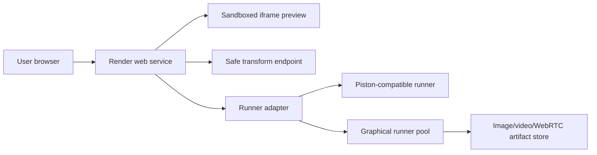

# PolyCompile Architecture

## Goals

PolyCompile separates the web product from the dangerous part: untrusted code execution. The Render web service handles identity, uploads, previews, API routing, and UI. Execution happens through runner adapters.

## Language Support

| Language | Current path | Production runner expectation |
| --- | --- | --- |
| HTML/CSS/JS | Browser iframe preview | Same, plus CSP and dependency import controls |
| JavaScript | Piston-compatible adapter | Node isolate with CPU/memory/time limits |
| Python | Piston-compatible adapter | Python isolate, turtle via virtual display capture |
| C/C++ | Piston-compatible adapter | GCC/Clang image with seccomp and readonly root FS |
| C# | Piston-compatible adapter | .NET SDK image with limited temp workspace |
| Rust | Piston-compatible adapter | Rust image with dependency cache and hard timeouts |

## Graphics: raylib, SDL2, turtle

Graphical programs need more than stdout. Use dedicated runner images with:

- `xvfb-run` or Wayland headless display.
- Mesa software rendering for basic OpenGL.
- Dependency images: `raylib`, `libsdl2-dev`, Python `turtle`, and language bindings.
- Output capture as PNG sequence, MP4, or live WebRTC stream.
- A hard frame/time budget so rendering jobs cannot run forever.

Do not run these inside the public Render web service. Render should call a private runner API, queue, or external sandbox provider.

## File Handling

The app supports folder upload via browser directory selection. The API sanitizes paths, rejects `..` segments, caps file count, and treats uploaded content as text for this scaffold. Production additions:

- Store projects in object storage instead of local disk.
- Add binary asset allowlists for images, fonts, and small media.
- Virus scan uploads before runner delivery.
- Preserve project manifests such as `package.json`, `Cargo.toml`, `.csproj`, and `Makefile`.

## Web Previewing

The client assembles `index.html`, CSS, and JS into an iframe with `sandbox="allow-scripts allow-forms"`. Production hardening should add:

- Per-preview origin isolation.
- CSP generated per preview.
- Import-map allowlists.
- Optional dependency bundling for npm/browser packages.
- Console capture from iframe to output panel.

## AI Agent

A side agent belongs in the workspace if it behaves like a pair programmer, not an invisible executor. Best responsibilities:

- Explain errors in plain language.
- Suggest fixes with explicit diffs.
- Generate small tests.
- Identify missing dependency files.
- Warn when a transform may break semantics.

It should not run untrusted code secretly, install packages silently, or overwrite user files without approval.
